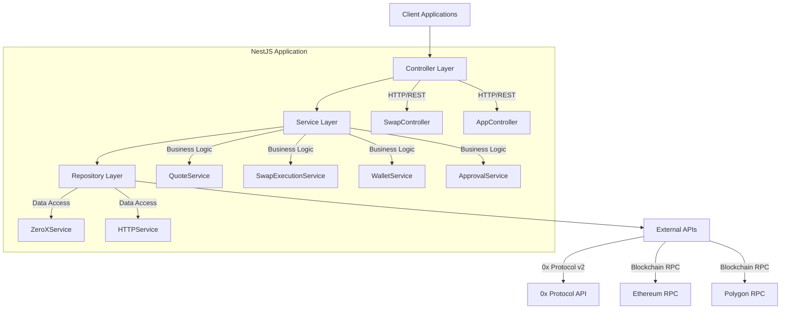

# 📚 Aggregator AML APIs - Comprehensive Codebase Documentation

## Table of Contents
1. [Architecture Overview](#architecture-overview)
2. [Project Structure](#project-structure)
3. [Core Components](#core-components)
4. [Service Layer Analysis](#service-layer-analysis)
5. [API Endpoints Documentation](#api-endpoints-documentation)
6. [Data Models & DTOs](#data-models--dtos)
7. [Utilities & Shared Components](#utilities--shared-components)
8. [Design Patterns Implementation](#design-patterns-implementation)
9. [Integration Points](#integration-points)
10. [Extension Guidelines](#extension-guidelines)
11. [Future Enhancement Opportunities](#future-enhancement-opportunities)

---

## 🏗️ Architecture Overview

### High-Level Architecture



### Architectural Patterns

- **Primary**: Layered Architecture (N-Tier)
- **Secondary**: Microservice-ready Modular Monolith
- **Communication**: RESTful API with JSON
- **Framework**: NestJS with TypeScript
- **Database**: Stateless (External API integration)

---

## 📁 Project Structure

```
aggregator-aml-apis/
├── 📁 src/
│   ├── 📁 core/                    # Core application infrastructure
│   │   ├── 📁 filters/             # Global exception filters
│   │   ├── 📁 guards/              # Security guards (rate limiting)
│   │   ├── 📁 interceptors/        # Request/response interceptors
│   │   ├── 📁 pipes/               # Validation pipes
│   │   └── core.module.ts          # Core module configuration
│   │
│   ├── 📁 shared/                  # Shared utilities and services
│   │   ├── 📁 services/            # Shared services (HTTP)
│   │   ├── 📁 utils/               # Utility functions
│   │   │   ├── chain.utils.ts      # Blockchain chain utilities
│   │   │   ├── ethereum.utils.ts   # Ethereum-specific utilities
│   │   │   ├── validation.utils.ts # Input validation utilities
│   │   │   ├── viem.utils.ts       # Viem blockchain client utilities
│   │   │   └── error-handling.utils.ts # Error handling utilities
│   │   └── shared.module.ts        # Shared module configuration
│   │
│   ├── 📁 swap/                    # Main swap functionality
│   │   ├── 📁 controllers/         # HTTP controllers
│   │   │   ├── swap.controller.ts  # Main swap API controller
│   │   │   └── swap.controller.spec.ts # Controller tests
│   │   │
│   │   ├── 📁 services/            # Business logic services
│   │   │   ├── 📁 aggregators/     # DEX aggregator integrations
│   │   │   │   └── zero-x.service.ts # 0x Protocol integration
│   │   │   ├── aggregator-manager.service.ts # Aggregator orchestration
│   │   │   ├── approval.service.ts # Token approval management
│   │   │   ├── permit2.service.ts  # Permit2 gasless approvals
│   │   │   ├── permit2-workflow.service.ts # Permit2 workflow management
│   │   │   ├── quote.service.ts    # Quote retrieval service
│   │   │   ├── swap-execution.service.ts # Swap execution logic
│   │   │   ├── transaction-parser.service.ts # Transaction analysis
│   │   │   └── wallet.service.ts   # Wallet operations
│   │   │
│   │   ├── 📁 dto/                 # Data Transfer Objects
│   │   │   ├── approval-request.dto.ts
│   │   │   ├── balance-request.dto.ts
│   │   │   ├── swap-request.dto.ts
│   │   │   └── [other DTOs]
│   │   │
│   │   ├── 📁 models/              # Domain models and interfaces
│   │   │   └── swap-request.model.ts
│   │   │
│   │   └── swap.module.ts          # Swap module configuration
│   │
│   ├── app.controller.ts           # Root application controller
│   ├── app.module.ts              # Root application module
│   ├── app.service.ts             # Root application service
│   └── main.ts                    # Application bootstrap
│
├── 📁 test/                       # End-to-end tests
├── 📄 package.json               # Dependencies and scripts
├── 📄 tsconfig.json              # TypeScript configuration
├── 📄 nest-cli.json              # NestJS CLI configuration
├── 📄 README.md                  # User documentation
└── 📄 CODEBASE_DOCUMENTATION.md # This comprehensive documentation
```

---

## 🧩 Core Components

### 1. Application Bootstrap (`main.ts`)

```typescript
async function bootstrap() {
  const app = await NestFactory.create(AppModule);
  
  // Global configurations
  app.enableCors();
  app.useGlobalPipes(new ValidationPipe());
  app.useGlobalFilters(new GlobalExceptionFilter());
  
  // Swagger documentation
  const config = new DocumentBuilder()
    .setTitle('Aggregator AML APIs')
    .setDescription('DEX Aggregator with AML capabilities')
    .setVersion('1.0')
    .build();
  
  await app.listen(3000);
}
```

**Purpose**: Application entry point with global configurations

### 2. Core Module (`core/core.module.ts`)

```typescript
@Module({
  providers: [
    // Global exception filter
    { provide: APP_FILTER, useClass: GlobalExceptionFilter },
    
    // Rate limiting guard
    { provide: APP_GUARD, useClass: RateLimitGuard },
    
    // Request/response interceptors
    { provide: APP_INTERCEPTOR, useClass: LoggingInterceptor },
    { provide: APP_INTERCEPTOR, useClass: ResponseTransformInterceptor },
  ],
})
export class CoreModule {}
```

**Purpose**: Infrastructure concerns (security, logging, error handling)

### 3. Shared Module (`shared/shared.module.ts`)

```typescript
@Module({
  providers: [HttpService],
  exports: [HttpService],
})
export class SharedModule {}
```

**Purpose**: Reusable utilities and services across modules

---

## 🔧 Service Layer Analysis

### Enhanced Provider Ports Architecture

The project now implements a **Provider Ports** pattern for maximum extensibility:

**Provider Categories**:
- **EVM Aggregators** (`IOnchainAggregator`): 0x, 1inch, Odos, ParaSwap
- **Meta Aggregators** (`IMetaAggregator`): LI.FI, Socket, Rango  
- **Solana Routers** (`ISolanaRouter`): Jupiter, Orca, Raydium
- **Native L1 Routers** (`INativeRouter`): THORChain, Maya

**Current Implementations**:
- `ZeroXService`: 0x Protocol v2 (AllowanceHolder + Permit2)
- `OneInchService`: 1inch v5 with dynamic spender addresses
- `LiFiService`: Cross-chain routing with confidence scoring
- `JupiterService`: Solana's premier aggregator
- `THORChainService`: Bitcoin to EVM cross-chain swaps

The `EnhancedAggregatorManagerService` orchestrates all providers with health monitoring and intelligent routing.

**📚 Complete Provider Documentation**: [PROVIDER_PORTS_ARCHITECTURE.md](./PROVIDER_PORTS_ARCHITECTURE.md)

### 1. Quote Service (`swap/services/quote.service.ts`)

**Responsibilities**:
- Retrieve swap quotes from aggregators
- Validate input parameters
- Handle multiple quote comparisons
- Provide price discovery

**Key Methods**:
```typescript
// Primary quote retrieval
async getQuote(chainId, sellToken, buyToken, sellAmount, taker, ...): Promise<SwapQuote>

// Multiple aggregator quotes
async getMultipleQuotes(...): Promise<Array<{ aggregator: AggregatorType; quote: SwapQuote }>>

// Best quote selection
async getBestQuote(...): Promise<{ aggregator: AggregatorType; quote: SwapQuote }>

// Quote comparison
async compareQuotes(...): Promise<{ quotes, bestAggregator, priceDifference }>

// Price discovery (no transaction data)
async getPrice(...): Promise<any>
```

**Integration Points**:
- `AggregatorManagerService` for orchestration
- `ValidationUtils` for input validation
- External 0x Protocol API

### 2. Swap Execution Service (`swap/services/swap-execution.service.ts`)

**Responsibilities**:
- Execute actual swap transactions
- Handle pre-flight checks
- Manage approval workflows
- Parse transaction results

**Key Methods**:
```typescript
// Main swap execution
async executeSwap(chainId, privateKey, sellToken, buyToken, sellAmount, ...): Promise<SwapResult>

// AllowanceHolder strategy execution
async executeAllowanceHolderSwap(chainId, privateKey, transaction, metadata): Promise<AllowanceHolderResult>

// Pre-flight validations
private async performPreFlightChecks(request: SwapRequest): Promise<void>
private async checkWalletBalance(request: SwapRequest): Promise<void>
private async handleApproval(chainId, privateKey, sellToken, quote, aggregatorType): Promise<void>
```

**Workflow**:
1. Input validation
2. Wallet setup and balance checks
3. Quote retrieval with retry logic
4. Approval handling (if needed)
5. Transaction execution
6. Result parsing and formatting

### 3. Wallet Service (`swap/services/wallet.service.ts`)

**Responsibilities**:
- Wallet balance queries
- Transaction execution
- Multi-token balance retrieval
- Transaction confirmation waiting

**Key Methods**:
```typescript
// Balance operations
async getBalance(chainId: number, walletAddress: string, tokenAddress: string)
async getMultipleBalances(chainId: number, walletAddress: string, tokenAddresses: string[])

// Transaction operations
async executeSwap(chainId, privateKey, to, data, value, gas): Promise<string>
async waitForTransactionConfirmation(chainId: number, txHash: string): Promise<TransactionReceipt>

// Parsing operations
parseTransactionReceipt(receipt: TransactionReceipt, tokenAddress: string): TokenTransfer[]
```

### 4. Approval Service (`swap/services/approval.service.ts`)

**Responsibilities**:
- ERC-20 token approval management
- Approval status checking
- Permit2 availability detection
- Approval transaction execution

**Key Methods**:
```typescript
// Approval status
async getApprovalStatus(chainId, tokenAddress, owner, spender, amount?)
async isApprovalNeeded(chainId, tokenAddress, owner, spender, amount): Promise<boolean>

// Approval execution
async executeApproval(chainId, privateKey, tokenAddress, spender, amount): Promise<ApprovalResult>

// Permit2 support
async isPermit2Available(chainId: number, tokenAddress: string): Promise<boolean>
```

### 5. Permit2 Service (`swap/services/permit2.service.ts`)

**Responsibilities**:
- EIP-712 signature generation
- Permit2 contract interactions
- Gasless approval workflows
- Signature validation

**Key Methods**:
```typescript
// EIP-712 signing
async signPermit2Data(chainId: number, privateKey: string, permit2Data: Permit2Data): Promise<string>

// Transaction data modification
async appendSignatureToTxData(txData: string, signature: string): Promise<string>

// Validation
validatePermit2Data(permit2Data: any): boolean
isPermit2Supported(chainId: number): boolean
```

### 6. ZeroX Service (`swap/services/aggregators/zero-x.service.ts`)

**Responsibilities**:
- 0x Protocol v2 API integration
- Quote retrieval with strategy support
- Permit2 data extraction
- Error handling and retries

**Key Methods**:
```typescript
// Quote retrieval
async getQuote(request: SwapRequest): Promise<SwapQuote>
async getQuoteWithStrategy(request: SwapRequest, strategy: ApprovalStrategy): Promise<SwapQuote>

// Price discovery
async getPrice(request: SwapRequest): Promise<any>

// Utility methods
private buildQuoteParams(request: SwapRequest): any
private extractPermit2Data(response: any): Permit2Data | undefined
```

---

## 🌐 API Endpoints Documentation

### Core Swap Endpoints

#### 1. Quote Retrieval
```http
POST /swap/quote
POST /swap/quotes            # Multiple aggregators
POST /swap/best-quote        # Best price selection
POST /swap/compare-quotes    # Detailed comparison
```

#### 2. AllowanceHolder Strategy (Recommended)
```http
POST /swap/allowance-holder/quote    # Get quote
POST /swap/allowance-holder/price    # Get price only
POST /swap/allowance-holder/execute  # Execute swap
```

#### 3. Permit2 Strategy (Advanced)
```http
POST /swap/permit2/quote    # Get quote with permit2 data
POST /swap/permit2/info     # Extract permit2 information
```

#### 4. Transaction Management
```http
POST /swap/execute                # Main swap execution
POST /swap/approval/status        # Check approval status
POST /swap/approval/execute       # Execute approval
POST /swap/parse-transaction      # Parse transaction data
```

#### 5. Utility Endpoints
```http
POST /swap/balance          # Single token balance
POST /swap/balances         # Multiple token balances
GET  /swap/aggregators      # Supported aggregators
GET  /swap/health          # Health check
```

### Request/Response Patterns

#### Quote Request
```typescript
interface SwapQuoteRequestDto {
  chainId: number;
  sellToken: string;
  buyToken: string;
  sellAmount: string;
  taker: string;
  recipient?: string;
  slippagePercentage?: number;
  deadline?: number;
  aggregator?: AggregatorType;
}
```

#### Quote Response
```typescript
interface SwapQuote {
  sellToken: string;
  buyToken: string;
  sellAmount: string;
  buyAmount: string;
  minBuyAmount: string;
  gas: string;
  gasPrice: string;
  to: string;
  data: string;
  value: string;
  allowanceTarget: string;
  aggregator: string;
  priceImpact: string;
  estimatedGas: string;
  permit2?: Permit2Data;  // For gasless approvals
}
```

---

## 📊 Data Models & DTOs

### Core Models

#### 1. Swap Request Model (`swap/models/swap-request.model.ts`)
```typescript
interface SwapRequest {
  chainId: number;
  sellToken: string;
  buyToken: string;
  sellAmount: string;
  taker: string;
  recipient: string;
  slippagePercentage?: number;
  deadline?: number;
  aggregator?: AggregatorType;
  approvalStrategy?: ApprovalStrategy;
}

enum AggregatorType {
  ZEROX = 'zerox'
}

enum ApprovalStrategy {
  ALLOWANCE_HOLDER = 'allowance-holder',
  PERMIT2 = 'permit2'
}
```

#### 2. Permit2 Data Model
```typescript
interface Permit2Data {
  type: string;
  hash: string;
  eip712: {
    types: Record<string, any>;
    domain: Record<string, any>;
    message: Record<string, any>;
    primaryType: string;
  };
}
```

### DTO Categories

#### 1. Request DTOs
- `SwapQuoteRequestDto` - Quote requests
- `SwapExecutionRequestDto` - Swap execution
- `ApprovalRequestDto` - Approval operations
- `BalanceRequestDto` - Balance queries
- `TransactionParseRequestDto` - Transaction parsing

#### 2. Response DTOs
- `SwapQuote` - Quote responses
- `SwapResult` - Execution results
- `TransactionParseResponseDto` - Parsed transaction data

---

## 🛠️ Utilities & Shared Components

### 1. Viem Utilities (`shared/utils/viem.utils.ts`)

**Purpose**: Centralized blockchain client management
```typescript
// Chain configuration
export function getViemChain(chainId: number): Chain

// Client creation
export function createViemPublicClient(chainId: number): PublicClient
export function createViemWalletClient(chainId: number, privateKey: string): WalletClient

// Account management
export function getAccountFromPrivateKey(privateKey: string): PrivateKeyAccount
```

### 2. Validation Utilities (`shared/utils/validation.utils.ts`)

**Purpose**: Input validation and sanitization
```typescript
// Chain validation
export function validateChainId(chainId: number): void

// Address validation
export function validateTokenAddress(address: string): void
export function validateWalletAddress(address: string): void

// Amount validation
export function validateAmount(amount: string): void
export function validateSlippage(slippage: number): void
export function validateDeadline(deadline: number): void
```

### 3. Error Handling Utilities (`shared/utils/error-handling.utils.ts`)

**Purpose**: Standardized error processing
```typescript
// Error context interface
interface ErrorContext {
  operation: string;
  chainId?: number;
  tokenAddress?: string;
  walletAddress?: string;
  amount?: string;
  aggregator?: string;
}

// Centralized error handling
export async function executeWithErrorHandling<T>(
  operation: () => Promise<T>,
  context: ErrorContext
): Promise<T>

// Logging utilities
export function logError(error: Error, context: ErrorContext): void
```

### 4. Chain Utilities (`shared/utils/chain.utils.ts`)

**Purpose**: Blockchain-specific operations
```typescript
// Native token detection
export function isNativeToken(tokenAddress: string): boolean

// Chain configuration
export function getChainConfig(chainId: number): ChainConfig
export function getNativeTokenSymbol(chainId: number): string
```

---

## 🎨 Design Patterns Implementation

### 1. Strategy Pattern

**Implementation**: Approval strategies and aggregator selection
```typescript
// Strategy enumeration
enum ApprovalStrategy {
  ALLOWANCE_HOLDER = 'allowance-holder',
  PERMIT2 = 'permit2'
}

// Strategy usage
const strategy = request.approvalStrategy || ApprovalStrategy.ALLOWANCE_HOLDER;
const quote = await this.getQuoteWithStrategy(request, strategy);
```

### 2. Factory Pattern

**Implementation**: Blockchain client creation
```typescript
// Factory function
export function createViemClients(chainId: number, privateKey?: string) {
  const chain = getViemChain(chainId);
  const transport = http(getRpcUrl(chainId));
  
  const publicClient = createPublicClient({ chain, transport });
  const walletClient = privateKey ? 
    createWalletClient({ chain, transport, account: privateKeyToAccount(privateKey) }) : 
    null;
    
  return { publicClient, walletClient };
}
```

### 3. Facade Pattern

**Implementation**: AggregatorManagerService
```typescript
@Injectable()
export class AggregatorManagerService {
  // Simplifies complex aggregator ecosystem
  async getQuote(request: SwapRequest, aggregatorType?: AggregatorType): Promise<SwapQuote> {
    const aggregator = this.selectAggregator(request.chainId, aggregatorType);
    return await aggregator.getQuote(request);
  }
  
  // Hides complexity of aggregator selection
  private selectAggregator(chainId: number, type?: AggregatorType): AggregatorService {
    return this.zeroXService; // Currently only 0x Protocol
  }
}
```

### 4. Template Method Pattern

**Implementation**: Swap execution workflow
```typescript
// Template in SwapExecutionService
async executeSwap(...params): Promise<SwapResult> {
  // Template steps
  this.validateInputs();           // Step 1: Validation
  await this.performPreFlightChecks();  // Step 2: Pre-flight
  const quote = await this.getQuote();  // Step 3: Quote retrieval
  await this.handleApproval();     // Step 4: Approval (customizable)
  const result = await this.executeTransaction(); // Step 5: Execution
  return this.parseResult();       // Step 6: Result processing
}
```

### 5. Repository Pattern

**Implementation**: External API abstraction
```typescript
// Abstract repository
abstract class AggregatorService {
  abstract getQuote(request: SwapRequest): Promise<SwapQuote>;
  abstract getPrice(request: SwapRequest): Promise<any>;
}

// Concrete implementation
@Injectable()
export class ZeroXService extends AggregatorService {
  async getQuote(request: SwapRequest): Promise<SwapQuote> {
    // 0x Protocol specific implementation
  }
}
```

---

## 🔗 Integration Points

### 1. External APIs

#### 0x Protocol v2 Integration
```typescript
// Base URL and endpoints
private readonly baseUrl = 'https://api.0x.org';
private readonly endpoints = {
  quote: '/swap/permit2/quote',
  price: '/swap/permit2/price',
  allowanceHolder: '/swap/allowance-holder/quote'
};

// API call with strategy
async getQuoteWithStrategy(request: SwapRequest, strategy: ApprovalStrategy): Promise<SwapQuote> {
  const endpoint = strategy === ApprovalStrategy.PERMIT2 ? 
    this.endpoints.quote : 
    this.endpoints.allowanceHolder;
    
  const response = await this.httpService.get(`${this.baseUrl}${endpoint}`, {
    params: this.buildQuoteParams(request)
  });
  
  return this.parseQuoteResponse(response.data);
}
```

### 2. Blockchain Networks

#### Supported Chains
```typescript
const SUPPORTED_CHAINS = {
  1: 'Ethereum Mainnet',
  137: 'Polygon',
  56: 'BSC',
  42161: 'Arbitrum',
  10: 'Optimism',
  8453: 'Base',
  43114: 'Avalanche'
};

// RPC Configuration
const RPC_URLS = {
  1: process.env.ETHEREUM_RPC_URL,
  137: process.env.POLYGON_RPC_URL,
  56: process.env.BSC_RPC_URL,
  // ... other chains
};
```

### 3. Smart Contract Interactions

#### ERC-20 Token Approvals
```typescript
// Standard ERC-20 approval
async executeApproval(chainId: number, privateKey: string, tokenAddress: string, spender: string, amount: string) {
  const { walletClient } = createViemClients(chainId, privateKey);
  
  const hash = await walletClient.writeContract({
    address: tokenAddress as `0x${string}`,
    abi: ERC20_ABI,
    functionName: 'approve',
    args: [spender as `0x${string}`, BigInt(amount)]
  });
  
  return { transactionHash: hash };
}
```

#### Permit2 Contract Integration
```typescript
// Permit2 signature generation
async signPermit2Data(chainId: number, privateKey: string, permit2Data: Permit2Data): Promise<string> {
  const account = getAccountFromPrivateKey(privateKey);
  
  const signature = await signTypedData({
    account,
    domain: permit2Data.eip712.domain,
    types: permit2Data.eip712.types,
    primaryType: permit2Data.eip712.primaryType,
    message: permit2Data.eip712.message,
  });
  
  return signature;
}
```

---

## 🚀 Extension Guidelines

### 1. Adding New Aggregators

#### Step 1: Create Aggregator Service
```typescript
// src/swap/services/aggregators/new-aggregator.service.ts
@Injectable()
export class NewAggregatorService extends AggregatorService {
  async getQuote(request: SwapRequest): Promise<SwapQuote> {
    // Implement aggregator-specific logic
  }
  
  async getPrice(request: SwapRequest): Promise<any> {
    // Implement price discovery
  }
}
```

#### Step 2: Update Aggregator Manager
```typescript
// Update AggregatorManagerService
@Injectable()
export class AggregatorManagerService {
  constructor(
    private readonly zeroXService: ZeroXService,
    private readonly newAggregatorService: NewAggregatorService // Add new service
  ) {}
  
  private selectAggregator(chainId: number, type?: AggregatorType): AggregatorService {
    switch (type) {
      case AggregatorType.ZEROX:
        return this.zeroXService;
      case AggregatorType.NEW_AGGREGATOR: // Add new case
        return this.newAggregatorService;
      default:
        return this.zeroXService;
    }
  }
}
```

#### Step 3: Update Enums and Types
```typescript
// Update AggregatorType enum
enum AggregatorType {
  ZEROX = 'zerox',
  NEW_AGGREGATOR = 'new-aggregator'
}
```

### 2. Adding New Blockchain Networks

#### Step 1: Update Chain Configuration
```typescript
// Update supported chains
const SUPPORTED_CHAINS = {
  // ... existing chains
  250: 'Fantom',  // Add new chain
};

// Update Viem chain mapping
export function getViemChain(chainId: number): Chain {
  switch (chainId) {
    // ... existing cases
    case 250:
      return fantom; // Import from viem/chains
    default:
      throw new Error(`Unsupported chain ID: ${chainId}`);
  }
}
```

#### Step 2: Add RPC Configuration
```typescript
// Update environment configuration
RPC_URLS[250] = process.env.FANTOM_RPC_URL;
```

#### Step 3: Update Native Token Detection
```typescript
// Update chain utilities if needed
export function getNativeTokenSymbol(chainId: number): string {
  switch (chainId) {
    // ... existing cases
    case 250:
      return 'FTM';
    default:
      return 'ETH';
  }
}
```

### 3. Adding AML Functionality

#### Step 1: Create AML Module
```typescript
// src/aml/aml.module.ts
@Module({
  controllers: [AmlController],
  providers: [AmlService, ScoringService, DecisionService],
  exports: [AmlService],
})
export class AmlModule {}
```

#### Step 2: Create AML Services
```typescript
// src/aml/services/aml.service.ts
@Injectable()
export class AmlService {
  async calculateRiskScore(address: string, transactionHash: string): Promise<AmlScore> {
    // Implement risk scoring logic
  }
  
  async checkCompliance(address: string): Promise<ComplianceResult> {
    // Implement compliance checking
  }
}
```

#### Step 3: Create AML Controller
```typescript
// src/aml/controllers/aml.controller.ts
@Controller('aml')
export class AmlController {
  @Post('check')
  async checkCompliance(@Body() request: AmlCheckRequestDto) {
    return await this.amlService.checkCompliance(request.address);
  }
  
  @Post('score')
  async calculateScore(@Body() request: AmlScoreRequestDto) {
    return await this.amlService.calculateRiskScore(request.address, request.txHash);
  }
}
```

### 4. Adding Database Persistence

#### Step 1: Add Database Module
```typescript
// Install dependencies: @nestjs/typeorm typeorm mysql2

// src/database/database.module.ts
@Module({
  imports: [
    TypeOrmModule.forRoot({
      type: 'mysql',
      host: process.env.DB_HOST,
      port: parseInt(process.env.DB_PORT),
      username: process.env.DB_USERNAME,
      password: process.env.DB_PASSWORD,
      database: process.env.DB_NAME,
      entities: [__dirname + '/../**/*.entity{.ts,.js}'],
      synchronize: false,
    }),
  ],
})
export class DatabaseModule {}
```

#### Step 2: Create Entities
```typescript
// src/swap/entities/swap-transaction.entity.ts
@Entity('swap_transactions')
export class SwapTransaction {
  @PrimaryGeneratedColumn()
  id: number;
  
  @Column()
  transactionHash: string;
  
  @Column()
  chainId: number;
  
  @Column()
  sellToken: string;
  
  @Column()
  buyToken: string;
  
  @Column()
  sellAmount: string;
  
  @Column()
  buyAmount: string;
  
  @CreateDateColumn()
  createdAt: Date;
}
```

#### Step 3: Create Repository Services
```typescript
// src/swap/services/swap-transaction.service.ts
@Injectable()
export class SwapTransactionService {
  constructor(
    @InjectRepository(SwapTransaction)
    private swapTransactionRepository: Repository<SwapTransaction>,
  ) {}
  
  async saveTransaction(transactionData: Partial<SwapTransaction>): Promise<SwapTransaction> {
    const transaction = this.swapTransactionRepository.create(transactionData);
    return await this.swapTransactionRepository.save(transaction);
  }
}
```

---

## 🔮 Future Enhancement Opportunities

### 1. Advanced Features

#### MEV Protection
```typescript
// src/mev/services/mev-protection.service.ts
@Injectable()
export class MevProtectionService {
  async protectTransaction(transaction: SwapTransaction): Promise<ProtectedTransaction> {
    // Implement MEV protection logic
    // - Private mempool submission
    // - Flashbots integration
    // - Bundle optimization
  }
}
```

#### Cross-Chain Swaps
```typescript
// src/bridge/services/bridge.service.ts
@Injectable()
export class BridgeService {
  async executeCrossChainSwap(
    fromChain: number,
    toChain: number,
    request: CrossChainSwapRequest
  ): Promise<CrossChainSwapResult> {
    // Implement cross-chain bridging
    // - Bridge protocol integration
    // - Multi-step transaction coordination
    // - Cross-chain state tracking
  }
}
```

#### Advanced Order Types
```typescript
// src/orders/services/order.service.ts
@Injectable()
export class OrderService {
  async createLimitOrder(request: LimitOrderRequest): Promise<LimitOrder> {
    // Implement limit orders
  }
  
  async createDCAOrder(request: DCARequest): Promise<DCAOrder> {
    // Implement dollar-cost averaging
  }
  
  async createStopLossOrder(request: StopLossRequest): Promise<StopLossOrder> {
    // Implement stop-loss orders
  }
}
```

### 2. Performance Optimizations

#### Caching Layer
```typescript
// src/cache/cache.module.ts
@Module({
  imports: [
    CacheModule.register({
      store: redisStore,
      host: process.env.REDIS_HOST,
      port: process.env.REDIS_PORT,
    }),
  ],
})
export class CacheModule {}

// Usage in services
@Injectable()
export class QuoteService {
  @Cacheable('quotes', { ttl: 30 }) // 30 second cache
  async getQuote(request: SwapRequest): Promise<SwapQuote> {
    // Cached quote retrieval
  }
}
```

#### Rate Limiting Enhancements
```typescript
// src/throttle/throttle.module.ts
@Module({
  imports: [
    ThrottlerModule.forRoot({
      ttl: 60,
      limit: 100, // 100 requests per minute
      storage: new ThrottlerStorageRedisService(),
    }),
  ],
})
export class ThrottleModule {}
```

### 3. Monitoring and Analytics

#### Metrics Collection
```typescript
// src/metrics/services/metrics.service.ts
@Injectable()
export class MetricsService {
  async recordSwapMetrics(swap: SwapResult): Promise<void> {
    // Record swap volume, fees, success rates
  }
  
  async recordQuoteMetrics(quote: SwapQuote): Promise<void> {
    // Record quote response times, accuracy
  }
  
  async recordErrorMetrics(error: Error, context: string): Promise<void> {
    // Record error rates, types, patterns
  }
}
```

#### Health Monitoring
```typescript
// src/health/health.controller.ts
@Controller('health')
export class HealthController {
  @Get()
  @HealthCheck()
  check() {
    return this.health.check([
      () => this.http.pingCheck('0x API', 'https://api.0x.org'),
      () => this.typeorm.pingCheck('database'),
      () => this.disk.checkStorage('storage', { path: '/', threshold: 250 * 1024 * 1024 * 1024 }),
      () => this.memory.checkHeap('memory_heap', 150 * 1024 * 1024),
    ]);
  }
}
```

### 4. Security Enhancements

#### API Key Management
```typescript
// src/auth/services/api-key.service.ts
@Injectable()
export class ApiKeyService {
  async validateApiKey(apiKey: string): Promise<boolean> {
    // Implement API key validation
  }
  
  async getRateLimits(apiKey: string): Promise<RateLimits> {
    // Get user-specific rate limits
  }
}
```

#### Request Validation
```typescript
// src/validation/pipes/advanced-validation.pipe.ts
@Injectable()
export class AdvancedValidationPipe implements PipeTransform {
  transform(value: any, metadata: ArgumentMetadata) {
    // Implement advanced validation logic
    // - Address checksums
    // - Amount bounds checking
    // - Slippage limits
    // - Deadline validation
  }
}
```

---

## 📝 Development Guidelines

### Code Style and Standards

1. **TypeScript**: Strict mode enabled, explicit return types
2. **Naming Conventions**: PascalCase for classes, camelCase for methods/variables
3. **Documentation**: JSDoc comments for all public methods
4. **Error Handling**: Structured error responses with specific error codes
5. **Logging**: Structured logging with context information

### Testing Strategy

1. **Unit Tests**: All service methods
2. **Integration Tests**: API endpoints
3. **E2E Tests**: Complete user workflows
4. **Load Tests**: Performance under stress

### Deployment Considerations

1. **Environment Variables**: All configuration externalized
2. **Docker**: Containerized deployment
3. **Health Checks**: Kubernetes-ready health endpoints
4. **Monitoring**: Prometheus metrics, logging to centralized system
5. **Security**: API rate limiting, input validation, audit logging

---

## 🎯 Conclusion

This codebase provides a solid foundation for a DEX aggregator service with AML capabilities. The modular architecture, comprehensive error handling, and extensive documentation make it ready for production use and future enhancements.

Key strengths:
- ✅ Clean layered architecture
- ✅ Comprehensive error handling
- ✅ Multiple approval strategies
- ✅ Multi-chain support
- ✅ Production-ready patterns
- ✅ Extensive documentation

The codebase is well-positioned for extending into a full-featured DeFi platform with additional services like AML scoring, cross-chain swaps, advanced order types, and comprehensive analytics.